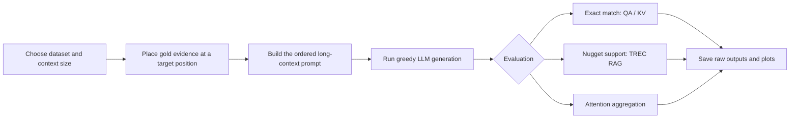

# Lost in the Middle

Experimental code for investigating how the position of relevant information in long contexts affects language-model behaviour. The repository includes controlled factoid retrieval experiments, TREC RAG correctness analyses, and generation-time attention measurements.

> **Research code:** this is not a packaged library. Many scripts preserve the original absolute paths, model selections, and output conventions. Review and update their configuration before running them on another machine.

<p align="left">
  
  
  
  
  
  
  
  
  
  
</p>

> These versions describe the environment that produced the committed experiment artefacts. Pin or record the versions used for any new run. Quantized experiments additionally use AWQ INT4 model builds; FlashAttention is needed only when retaining `attn_implementation="flash_attention_2"`.

**Navigate:** [Study](#study-at-a-glance) · [Experiments](#experiment-families) · [Setup](#requirements) · [Running](#running-the-factoid-experiments) · [Report](#report)

## Study at a glance

The accompanying findings report frames the repository around three related investigations:

- **Factoid retrieval:** controlled multi-document QA from NaturalQuestions-Open and synthetic UUID key-value retrieval. Both move the answer-bearing document or key-value pair across the input context to measure positional effects.
- **Attention sinks:** generation-time attention is aggregated across layers and heads for the QA setting, with experiments that compare dropout configurations.
- **Non-factoid RAG:** TREC RAG 2024/2025-style queries are evaluated with a nugget-based correctness pipeline while gold documents are moved among either semantically related *discriminator* documents or unrelated *noise* documents.

The report finds weak positional effects in multi-document QA, no consistent classic U-shaped curve for synthetic key-value retrieval at the tested context sizes, strong early-token attention sinks in the sampled QA prompts, and a clearer Lost-in-the-Middle pattern in the non-factoid qrel-1 discriminator setting. Treat these as experimental findings for the reported models, datasets, and configurations rather than general benchmarks.

## Project progress

| Workstream | Completed work | Main outputs | Status |
| --- | --- | --- | --- |
| KV retrieval | Position-controlled experiments at 75, 140, and 300 keys | Generations and accuracy-by-position plots | Complete baseline |
| Multi-document QA | Gold-document position experiments at 10, 20, and 30 documents | Exact-match counts and accuracy plots | Complete baseline |
| Attention-sink analysis | Per-token attention measurements across heads and layers | Attention data and line charts | Initial analysis complete |
| TREC RAG discriminator | Generation, nugget evaluation, and correctness scoring | JSONL pipeline outputs and six score plots | In progress |
| TREC RAG noise | Equivalent evaluation with noise contexts | JSONL outputs, error logs, and score plots | In progress |

## Experiment families

### Factoid analysis

`Factoid_Analysis/` contains two controlled experiments based on Hugging Face text-generation pipelines.

- **Key-value retrieval** (`KV_Retrieval/`) tests whether a model can return the value for a requested key when its key-value pair is moved through a JSON context. The report uses 500 examples at 75, 140, and 300 key-value pairs. `Model.py` runs the experiment; `prompt_creation_kv.py` constructs prompts.
- **Multi-document QA** (`QA/`) tests answer accuracy as the answer-bearing document moves through a retrieved-document set. The report uses 2,655 NaturalQuestions-Open examples at 10, 20, and 30 documents. `Model.py` runs the standard experiment and `Model_Oracle.py` runs the oracle-context variant. Prompt construction and answer matching live in `prompt_creation_qa.py` and `response_matching.py`.
- **Reference artefacts** (`Plots/`) include committed generations and accuracy plots for the KV (75, 140, and 300 keys) and QA (10, 20, and 30 documents) configurations.

### Non-factoid TREC RAG analysis

`Non_Factoid_Analysis/` holds parallel pipelines for the **TREC RAG 2024** and **TREC RAG 2025** collections. Each `Discriminator_and_Noise/` tree includes:

- BM25 indexing and retrieval helpers in `BM_25_Retrieval/Retriever/` (Pyserini/Lucene).
- Utilities for preparing query, relevance, and generator-input JSONL files.
- `Discriminator/Correctness_Analysis/`, which generates answers, extracts and scores nuggets, assigns answer support, evaluates six correctness metrics, and creates plots.
- `Noise/Correctness_Analysis/`, the corresponding noise-oriented workflow.

The main pipeline drivers are the `main.py` and `main_corr.py` files in the relevant `Correctness_Analysis/` directory. They are configured directly in source and save progress/output JSONL under `misc/`. The reported setup uses 60-document contexts (three qrel-3 gold documents and 57 non-gold documents) and averages all, strict, vital, and weighted nugget-support metrics across queries.

### Attention-sink analysis

`attention_sink_analysis/` measures generation-time attention over QA-style prompts. It provides scripts for average attention scores and average attention metrics with and without dropout:

- `average_attention_score_computation.py`
- `average_attention_metric_computation_with_dropout.py`
- `average_attention_metric_computation_without_dropout.py`

These scripts request `output_attentions=True` during generation and save plots below `attention_sink_analysis/Plot/`. The reported attention study evaluates the first generated token in 10-document QA prompts. `data/TREC_RAG_Dataset_export.py` exports the TREC RAG dataset through the Hugging Face `datasets` package.

## Experiment workflow



The core design keeps position as the primary experimental variable. QA and KV runs use deterministic decoding (`do_sample=False`); the TREC pipeline adds nugget-based correctness metrics, and attention experiments inspect the model's generation-time attention tensors. The complete result tables and figures remain in the project report, where they are accompanied by their methodology and interpretation.

## Repository layout

```text
Factoid_Analysis/
  KV_Retrieval/                    # Synthetic JSON key-value retrieval
  QA/                              # Multi-document question answering
  Plots/                           # Saved outputs and figures
Non_Factoid_Analysis/
  TREC-RAG_2024_Analysis/          # 2024 RAG discriminator/noise workflows
  TREC-RAG_2025_Analysis/          # 2025 RAG discriminator/noise workflows
attention_sink_analysis/           # Generation-time attention experiments
Report/                            # Project report (PDF)
```

## Requirements

- Python 3.10+
- PyTorch with CUDA support and an NVIDIA GPU suitable for the selected model
- A Hugging Face token with access to the selected gated model, where required
- Java and Pyserini for the BM25 retrieval scripts

Create a virtual environment and install the common dependencies:

```bash
python -m venv .venv
source .venv/bin/activate
python -m pip install --upgrade pip
pip install torch transformers matplotlib tqdm regex datasets pyserini setproctitle
```

The checked-in scripts use models including `meta-llama/Meta-Llama-3.1-8B-Instruct`, its AWQ INT4 variant, and `unsloth/mistral-7b-instruct-v0.3-bnb-4bit`. AWQ models, FlashAttention, and bitsandbytes may need compatible CUDA/PyTorch builds and additional model-specific dependencies.

## Before running

1. Set a Hugging Face token without committing it:

   ```bash
   export HF_TOKEN='hf_...'
   ```

   For each script you run, replace its `API_KEY` file read with:

   ```python
   import os

   TOKEN = os.environ["HF_TOKEN"]
   ```

2. Update absolute input, output, and `sys.path` entries. Many scripts reference the original `/home/irlab/sagnik/...` environment, and a few helper scripts contain a Windows path.
3. Confirm that the expected JSONL inputs are available. The repository includes selected data and sample/intermediate outputs, but some workflows expect additional corpora or retrieval results not committed here.
4. Start with a small position/query range. Attention extraction and multi-stage RAG evaluation are GPU- and memory-intensive.

## Running the factoid experiments

Run these scripts from their own directories so their local imports resolve:

```bash
cd Factoid_Analysis/KV_Retrieval
python Model.py
```

Configure the dataset, model, target positions, token, and output locations in `Model.py` first. It writes generation records, aggregates correct answers, and produces accuracy-by-position plots.

```bash
cd Factoid_Analysis/QA
python Model.py
# or, after configuring it:
python Model_Oracle.py
```

Set `PATHS`, the model/token, and output locations in the QA driver before execution. The oracle driver also requires its result accumulator to be initialized before appending results.

## Running the TREC pipelines

The TREC workflows are source-configured rather than command-line tools. Choose the 2024 or 2025 tree, then set the model, token, method, input/output paths, module paths, and iteration range in the appropriate `main.py` or `main_corr.py`. Run from its `Correctness_Analysis/` directory so the local module imports resolve.

For BM25 retrieval, first configure and run `BM_25_Retrieval/Retriever/indexer.py`; then configure and run `retriever.py`. Both expect a compatible Pyserini/Lucene environment and the target corpus.

## Reproducibility and limitations

- Keep the model revision, quantization, dataset version, target positions, decoding settings, CUDA version, and GPU model fixed when comparing runs.
- The factoid drivers use greedy decoding (`do_sample=False`); their output length is configured in the scripts.
- Preserve reference artefacts by writing new runs to distinct output files.
- No lockfile or pinned dependency set is provided.
- Several scripts assume CUDA and will not run unchanged on CPU-only machines.

## Report

The complete methodology, result tables, figures, and references are available at [`Report/Sagnik_Chandra_Lost_in_the_Middle_Report.pdf`](Report/Sagnik_Chandra_Lost_in_the_Middle_Report.pdf).
